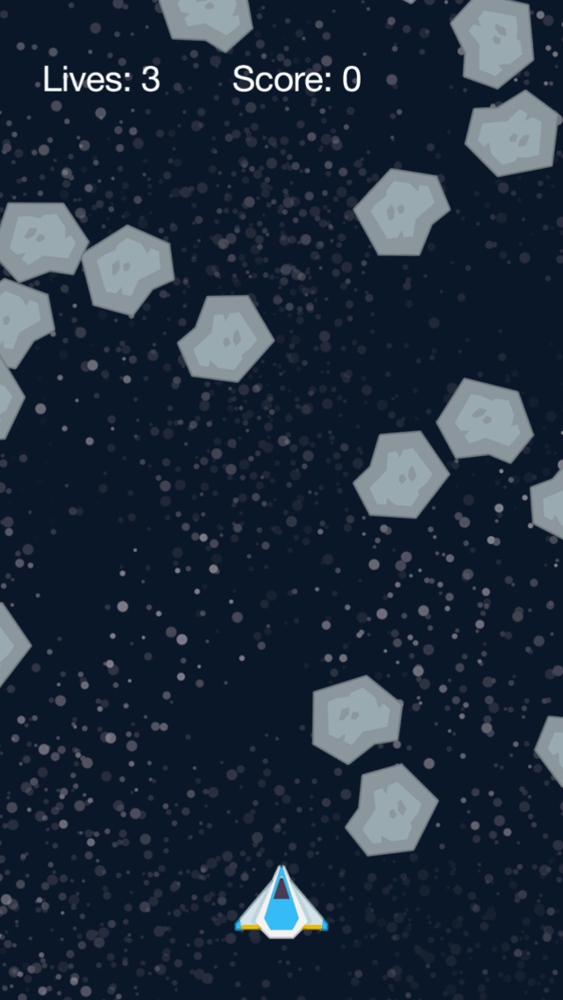

<h3 align="center">
  
  <br/>
  <b>Star Explorer</b>
</h3>

### What's this?

> A spaceship game to destroy astroids

> A simple game made with the Lua language, with the corona-sdk framework

<p align="center">
  
</p>

### How to run

```bash
git clone https://github.com/Ryannnkl/Star-Explorer-Game.git

# and open main.lua on corona-sdk
```

### this project is not completed :construction: ...
